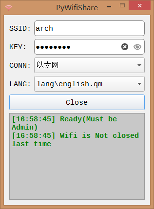

---
## pwshare
 - windows下wifi热点软件，基于python3.6，现主要开发程序为gui-qt(PyQt5)版本。



---
## FileList
 - pws.py         : 开启wifi热点的库
 - pwshare-cli.py : 命令行封装程序(不再更新)
 - pwshare-tk.pyw : tkinter-gui封装程序(不再更新)
 - pwshare-qt.pyw : qt-gui封装程序
 - pwshare.qrc    : qt-gui资源文件
 - lang           : qt-gui语言文件
 - res			  : 资源存放目录
 - ws			  : ws.dll工程，用于管理连接共享

## Make-exe
 - 按下列步骤生成exe文件

```
# 生成资源文件
cd pwshare
pyrcc5 -o pwshare_rc.py pwshare.qrc

# 使用pyinstaller生成exe，需要安装PyQt5，且将下面的path换成自己的
# 其中 -w == --noconsole
cd pwshare
pyinstaller --uac-admin -w --icon=./res/wifi.ico pwshare-qt.pyw

# 将lang和ws工程生成的ws.dll复制到./dist/pwshare-qt下

# 附：若是直接在cmd中打开pwshare-qt.pyw，需要使用管理员权限运行cmd。
```
 
---
## Contributors 
 - yehuohan - yehuohan@gamil.com, yehuohan@qq.com

